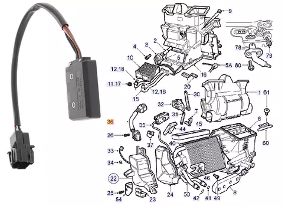
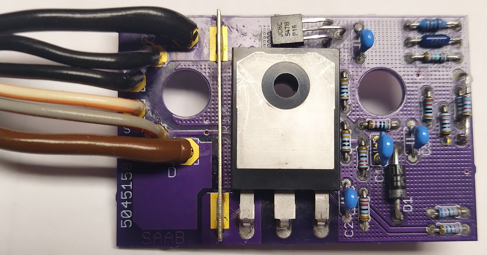
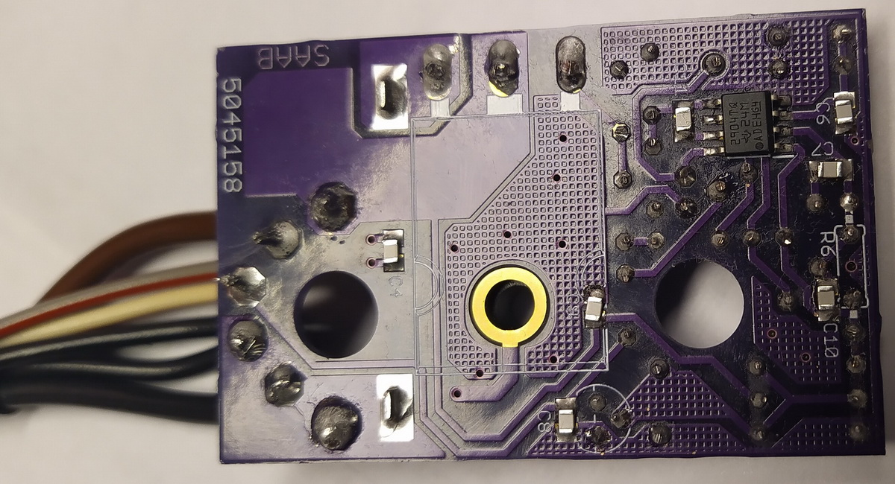

# Saab 5045158
Fan regulator mainboard/PCB to replace *SAAB 9-3 1998-2003* faulty regulator at reasonnable costs. #36 on diagram below

Due to high heating functioning tempreature, main MOSFET on board ends in failing. Board/soldering pads may be damaged as well as components.

This is made to replace PCB and its components, you need to take back from original SAAB part #5045158 :
  - wiring and connector
  - housing and screws
  - vertical plate on PCB 
  
## Build and use this at your own risks. High intensity involved that may lead to fire if not properly build **Check twice** there are no shortcuts or badly soldered components. 

Inital intention was to replace faulty part but after a close magnified look that showed the damage, I ended to make a complete 1:1 copy of original board layout under Eagle CAD. 
Schematic & board design files are available up here.

Ordering PCB is doable at [OSHPark](https://oshpark.com/projects/qXP4BEkH/view_design) (**note that they sell boards by sets of 3 minimum**) 

Here is a BOM to order parts - *I ordered at Mouser's, that's why I left their ref in table below*  
(***note that some parts are SMD - be sure to have ability and tools to solder them***)

| N° Mouser :          | N° de fab. :       | Desc. :                                                   | Client ref. | Qty |
|----------------------|--------------------|-----------------------------------------------------------|-------------|-----|
| 844-IRFP054PBF       | IRFP054PBF         | MOSFET TO247 N CHANNEL 60V                                | VT1         | 1   |
| 512-BC547B           | BC547B             | BJT NPN Epitaxial Silicon Transistor                      | VT2         | 1   |
| 603-MF0204FTE52-3K16 | MF0204FTE52-3K16   | Through hole 3.16Kohms 1% 1/8watt                         | R13         | 1   |
| 594-5063JD10K50F     | MBA02040C1052FC100 | Through hole 10.5Kohms 1% 1/8watt body size               | R11         | 1   |
| 71-CMF5078K700FHEB   | CMF5078K700FHEB    | Through hole 1/4watt 78.7Kohms 1%                         | R14         | 1   |
| 71-MBA02040C2200FCT0 | MBA02040C2200FCT00 | Through hole 1/4watt 220ohm 1% 50ppm                      | R8-9        | 2   |
| 594-5063JD6K200FT    | MBA02040C6201FRP00 | Through hole 6.2Kohms 1% 1/8watt body size                | R3,R7       | 2   |
| 594-5063JD2K200F5    | MBA02040C2201FCT00 | Through hole 2.2Kohms 1% 1/8watt body size                | R1-2        | 2   |
| 594-5063JD1K000FT    | MBA02040C1001FRP00 | Through hole 1Kohms 1% 1/8watt body size                  | R15         | 1   |
| 594-5063JD10K1%TR    | MBA02040C1002FRP00 | Through hole 10Kohms 1% 1/8watt body size                 | R4,R12      | 2   |
| 594-5063JD100K0F5    | MBA02040C1003FCT00 | Through hole 100Kohms 1% 1/8watt body size                | R5          | 1   |
| 595-LM2904BTQDRQ1    | LM2904BTQDRQ1      | Amplis-Op Automotive-grade du al 36-V 1.2-MHz op          | U1          | 1   |
| 594-5063JD18K70F     | MBA02040C1872FC100 | Through hole 18.7Kohms 1% 1/8watt body size               | R6          | 1   |
| 603-AC0805JNPO9BN181 | AC0805JRNPO9BN181  | MLCC - CMS 50 V 180pF C0G 0805 5%                         | C4, C6-11   | 7   |
| 810-FA14C0G2A103JNU6 | FA14C0G2A103JNU06  | Through hole MLCC 100V 0.01uF C0G 5% RAD LS:2.5mm         | C1          | 1   |
| 810-FA28X8R1H104KRU6 | FA28X8R1H104KRU06  | Through hole MLCC 50V 0.1uF X8R 10% RAD LS:5mm            | C2-3,C5     | 3   |
| 621-1N4007           | 1N4007-T           | Diode Vr/1000V Io/1A T/R                                  | D1          | 1   |
 
 
 

# Work done !

  
  
Have a look at the brand new board

  
Here's the new board soldered and ready to mount in car and enjoy a working fan  

